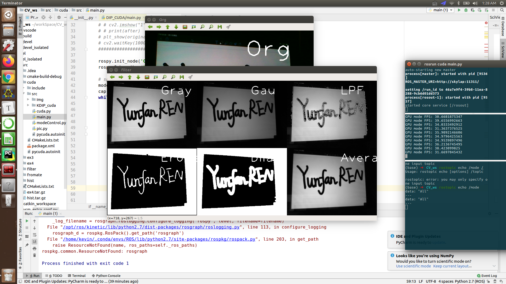

# Real Time Digital Image Process with CUDA and Python

> This project implements basic digital image processing based on Python. All source code and modules are implemented by RENyunfan himself.
>
> After using CUDA acceleration, it can still guarantee full frame rate operation when processing six different image processing algorithms simultaneously.

**Test platform**

* Python 3.5
* Ubuntu 16.04



# Quick start

* First, you have to star ros master.

```BASH
roscore
```

* Then install pycuda and its dependence.
* Then build the package

```bash
cd your_ws
catkin_make
```

* source your workspace 

```bash
source devel/setup.bash
```

* Start the program

```bash
rosrun cuda main.py
```

* Start the controller

```bash
rosrun cuda modeControl.py 
```

> Notes：
>
> ​	The modeControl.py is a controller based on ros topic. You can type 'All' to see all of the six method together, or you can type either: 'Gau', 'LPF', 'Gray', 'Ero', 'Ave', 'Dia', to see different DIP method separately.