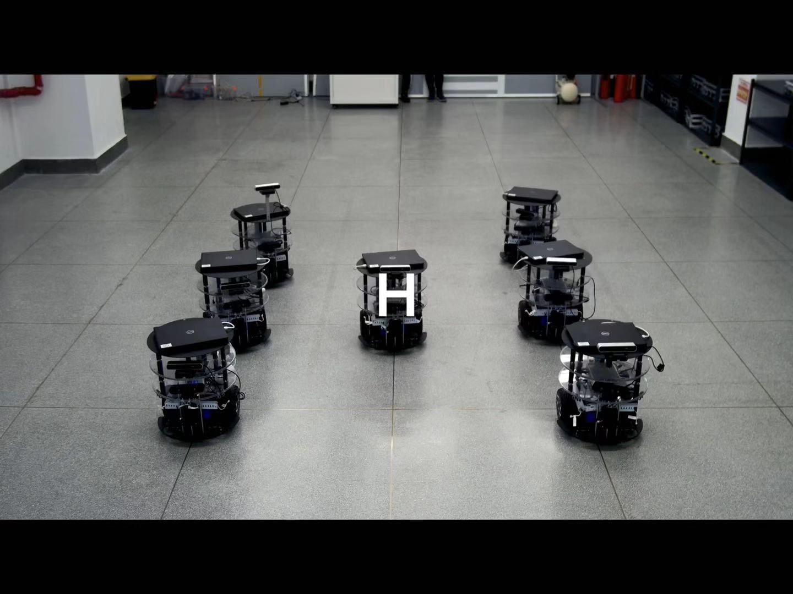
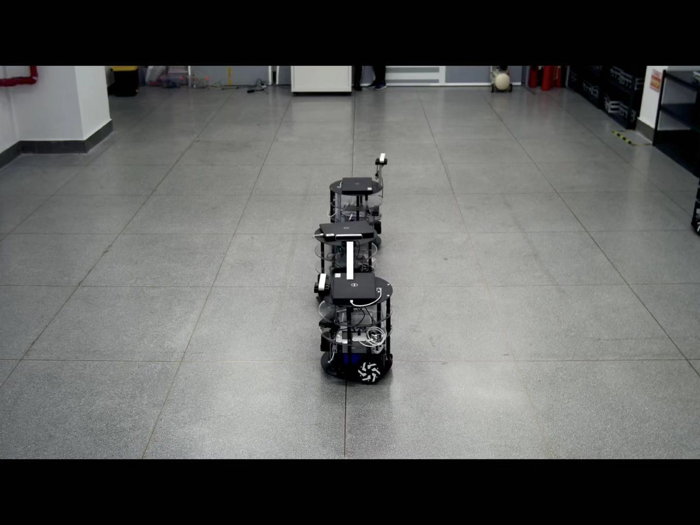
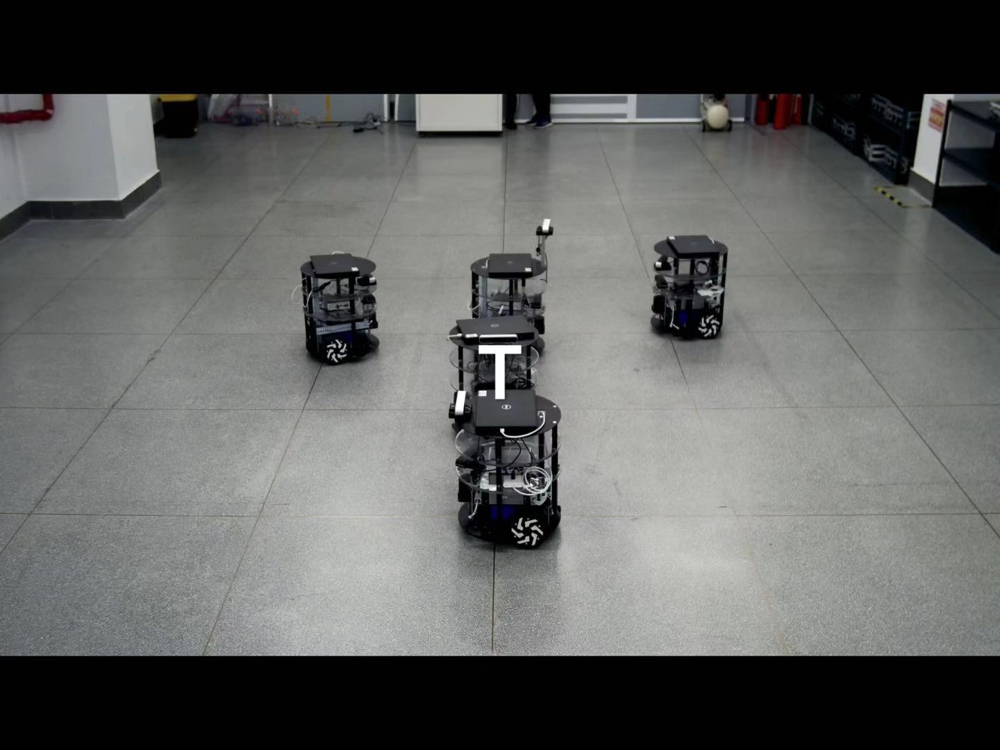

# ROS mobile robot formation

>This project is an autonomous formation of ROS mobile robots based on **laser SLAM**, which was used for the 100th anniversary celebration of HIT. Among them, RENyunfan's team members created the ROS distributed communication package based on **TCP / IP communication**, and realized the direct cross-machine transmission of message types in ROS. With this package you can easily separate
>The data in the ROS Topic is passed to different robots.







# Quick start

* First you should put the 'master' package in your master laptop as the server, and put the 'slave' package as the client.
*  [tcp_client.cpp](src/master_pkg/src/tcp_client.cpp) is the main source file to finish the communication job, you should set the slave ID and communication port in that file.
* Once you have copied there file to master and slave robot, you should build them.

```bash
cd master_ws
catkin_make
source devel/setup.bash
```

```bash
cd slave_ws
catkin_make
source devel/setup.bash
```

* Then you just need use roslaunch to star the program

```bash
roslaunch wtr_slave formate.launch
```

```bash
roslaunch wtr_master formate.launch
```