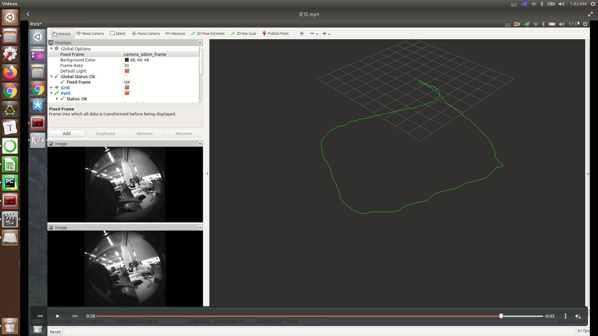
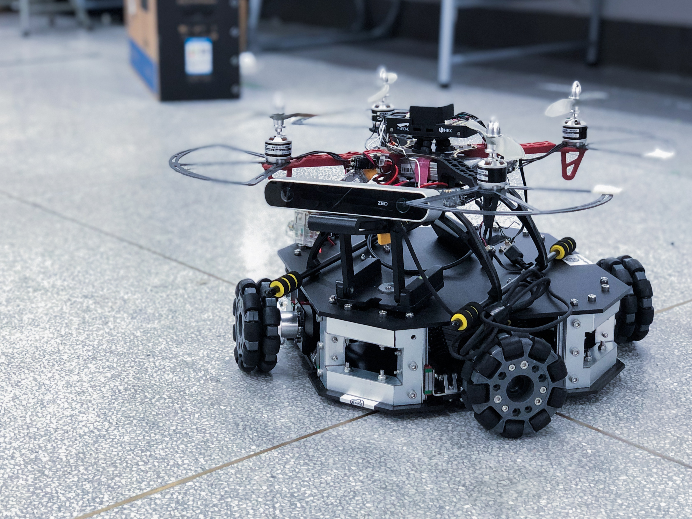
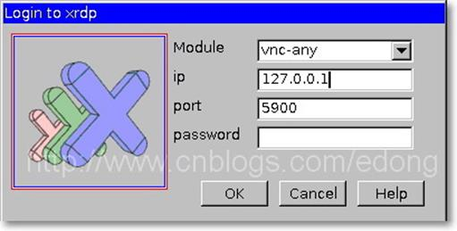

# UAV Competition ROS sys

> This project is applicable to the 2019 Guangdong-Hong Kong-Macao engineering training competition and drone rescue competition. This project is based on ROS to realize the vision SLAM positioning of the drone, the identification of the wounded, the picking up of items and the fixed-point delivery.


**Warning**

* This project can only be used for specific drones, please **DO NOT** use it directly on your own drones, the author will not be responsible for any consequences. Welcome to communicate with the author, modify some code to make it suitable for your drone.





# 0 How to use

- ## clone the project

  First time use:

  `	sudo chmod 777 ./wtr_launch.sh `

  Launch the drone:

  `./wtr_launch.sh`

- ## Remote screen

  - #### teamviewer

    https://jingyan.baidu.com/article/63f2362840c1320208ab3dc1.html
    ID:1381057908
    password:nrsl01

  - #### Windows

    https://www.cnblogs.com/edong/p/5262162.html

    Select vnc-any for Module and fill in 127.0.0.1 for ip.

  


# 1 Rules

* Variables should capitalize the first letter and split with '_'

> e.g. :Position_control_success

* Use data structure which has already exist in ROS

```c++
# This represents an estimate of a position and velocity in free space.  
# The pose in this message should be specified in the coordinate frame given by header.frame_id.
# The twist in this message should be specified in the coordinate frame given by the child_frame_id
Header header
string child_frame_id
geometry_msgs/PoseWithCovariance pose
geometry_msgs/TwistWithCovariance twist

std_msgs/Header header
string child_frame_id
geometry_msgs/PoseWithCovariance pose
geometry_msgs/TwistWithCovariance twist

geometry_msgs/Point position
float64 x
float64 y
float64 z
geometry_msgs/Quaternion orientation
float64 x
float64 y
float64 z
float64 w

# This represents a vector in free space. 
# It is only meant to represent a direction. Therefore, it does not
# make sense to apply a translation to it (e.g., when applying a 
# generic rigid transformation to a Vector3, tf2 will only apply the
# rotation). If you want your data to be translatable too, use the
# geometry_msgs/Point message instead.
geometry_msgs/Vector3
float64 x
float64 y
float64 z

geometry_msgs/Transform
# This represents the transform between two coordinate frames in free space.

Vector3 translation
# This represents a vector in free space. 
# It is only meant to represent a direction. Therefore, it does not
# make sense to apply a translation to it (e.g., when applying a 
# generic rigid transformation to a Vector3, tf2 will only apply the
# rotation). If you want your data to be translatable too, use the
# geometry_msgs/Point message instead.
float64 x
float64 y
float64 z
Quaternion rotation
# This represents an orientation in free space in quaternion form.
float64 x
float64 y
float64 z
float64 w

geometry_msgs/Twist
# This expresses velocity in free space broken into its linear and angular parts.
Vector3  linear
Vector3  angular
```


# 2 Data structure

```c++
struct PID_t{
    float Kp,Ki,Kd;
    float cur_error;
    float ref;
    float output;
    float outputMax;
    float error[2];
}
enum WTR_function_state{
    WTR_faild,
    WTR_success
}

enum workstate_e{
    GROUND,
    LAND,
    P2P_FLYING,
    SEARCH,
    CATCH
}
struct UAV{
    geometry_msgs::Twist WTR_twist;
    geometry_msgs::Point Target_pose,Present_pose;
    workstate_e Workstate;
    PID_t Position_x,Position_y,Position_z;
}

const int NOW = 0;
const int LAST = 1;


```


# 3 P2P part

```c++

/* PID CAL*/

WTR_function_state Vol_pub()
{
    
}

WTR_function_state Point_2_Point()
{
    Position_x.cur_error = UAV.Present_pose.x - UAV.Target_pose.x;
    Position_y.cur_error = UAV.Present_pose.y - UAV.Target_pose.y;
    Position_x.cur_error = UAV.Present_pose - UAV.Target_pose;
    PID_Calc(Position_x);
    PID_Calc(Position_y);
//    PID_Calc(Position_z);
}

void PID_Calc(PID_t *pid){
    
    pid->output += pid->KP * (pid->cur_error - pid->error[1])  + pid->KI * pid->cur_error + pid->KD * (pid->cur_error - 2 * pid->error[1] + pid->error[0]);
    
    pid->error[0] = pid->error[1]; 
	pid->error[1] = pid->cur_error;
	/* PID amplitude limitation */
	if(pid->output > pid->outputMax) pid->output = pid->outputMax;
	if(pid->output < -pid->outputMax) pid->output = -pid->outputMax;
}
```

# 4 Main

```c++
#include "ros/ros.h"
#include "geometry_msgs/Odometry"
#include "geometry_msgs/Transform"
#include "geomrtry_msgs/Point" 
#include <sstream>
/**
 * This tutorial demonstrates simple sending of messages over the ROS system.
 */
int main(int argc, char **argv)
{ 
   /**
    * The ros::init() function needs to see argc and argv so that it can perform
    * any ROS arguments and name remapping that were provided at the command line.
    * For programmatic remappings you can use a different version of init() which takes
    * remappings directly, but for most command-line programs, passing argc and rgv is
    * the easiest way to do it.  The third argument to init() is the name of the e.
    *
    * You must call one of the versions of ros::init() before using any other
    * part of the ROS system.
    */
   ros::init(argc, argv, "Master");
 
  /**
    * NodeHandle is the main access point to communications with the ROS system.
     * The first NodeHandle constructed will fully initialize this node, and the last
     * NodeHandle destructed will close down the node.
     */
    ros::NodeHandle n;
  
    /**
     * The advertise() function is how you tell ROS that you want to
     * publish on a given topic name. This invokes a call to the ROS
     * master node, which keeps a registry of who is publishing and who
    * is subscribing. After this advertise() call is made, the master
    * node will notify anyone who is trying to subscribe to this topic name,
    * and they will in turn negotiate a peer-to-peer connection with this
     * node.  advertise() returns a Publisher object which allows you to
     * publish messages on that topic through a call to publish().  Once
     * all copies of the returned Publisher object are destroyed, the topic
     * will be automatically unadvertised.
     *
     * The second parameter to advertise() is the size of the message queue
     * used for publishing messages.  If messages are published more quickly
     * than we can send them, the number here specifies how many messages to
     * buffer up before throwing some away.
     */
    ros::Publisher velocity_pub = n.advertise<geometry_msgs::Transform>("wtr/transform", 1000);
  
    ros::Rate loop_rate(1000);

    while (ros::ok())
    {
      /**
       * This is a message object. You stuff it with data, and then publish it.
       */
      std_msgs::String msg;
  
      std::stringstream ss;
      ss << "Velosity pub " << UAV.Twist.x;
      msg.data = ss.str();
  
      ROS_INFO("%s", msg.data.c_str());
  
      /**
       * The publish() function is how you send messages. The parameter
       * is the message object. The type of this object must agree with the type
       * given as a template parameter to the advertise<>() call, as was done
       * in the constructor above.
       */
      chatter_pub.publish(msg);
  
      ros::spinOnce();
  
      loop_rate.sleep();
      ++count;
    }
 
  
    return 0;
  }
```

